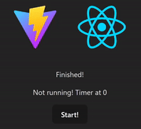

# @gabrielyotoo/react-use-timer &middot; [](https://github.com/gabrielyoto/react-use-timer/blob/main/LICENSE)[ ](https://www.npmjs.com/package/@gabrielyotoo/react-use-timer)

react-use-timer is a hook to help you with timers in React.



## Installation

To install run the following command in your project's folder if you are using yarn

```sh
yarn add @gabrielyotoo/react-use-timer
```

of if you are using npm

```sh
npm install @gabrielyotoo/react-use-timer
```

## Usage

A simple timer example showing the current time from 10 to 0.

```tsx
function App() {
  const [finished, setFinished] = useState(false);

  const { currentTime, running, startTimer, pauseTimer } = useTimer(10, {
    onFinish: () => {
      setFinished(true);
    },
    onStart: () => {
      setFinished(false);
    },
  });

  return (
    <>
      {finished ? <p>Finished!</p> : null}
      <div>
        {!running ? (
          <p>Not running! Timer at {currentTime}</p>
        ) : (
          <p>Timer at {currentTime}</p>
        )}
        <button onClick={startTimer}>{!running ? 'Start!' : 'Reset'}</button>
        {running ? <button onClick={pauseTimer}>Pause</button> : null}
      </div>
    </>
  );
}
```

You can also run the [example](./example/) project.

## API

| Name                                                                                                     | Type     | Description                      |
| -------------------------------------------------------------------------------------------------------- | -------- | -------------------------------- |
| useTimer(time: number, options?: [UseTimerOptions](#usetimeroptions)): [UseTimerReturn](#usetimerreturn) | function | Create timer with specified time |

### useTimer Params

| Name    | Type                                | Optional | Description                     |
| ------- | ----------------------------------- | -------- | ------------------------------- |
| time    | number                              | false    | The amount of ticks to run      |
| options | [UseTimerOptions](#usetimeroptions) | true     | The configuration for the timer |

### UseTimerReturn

| Name        | Type       | Description                     |
| ----------- | ---------- | ------------------------------- |
| currentTime | number     | The current time of the timer   |
| startTimer  | () => void | The function to start the timer |
| running     | boolean    | If the timer is running or not  |
| pauseTimer  | () => void | The function to pause the timer |

### UseTimerOptions

| Name      | Type       | Optional | Description                                      |
| --------- | ---------- | -------- | ------------------------------------------------ |
| autoStart | boolean    | true     | If the timer should start in the first render    |
| runEvery  | number     | true     | The amount in milliseconds the timer should tick |
| onStart   | () => void | true     | The function to be called when the timer starts  |
| onFinish  | () => void | true     | The function to be called after the time's up    |

## Contributing

Please, feel free to create issues and to open PRs. Be cautious to the tests and builds, because if your version doesn't pass they, your PR won't be approved and merged
